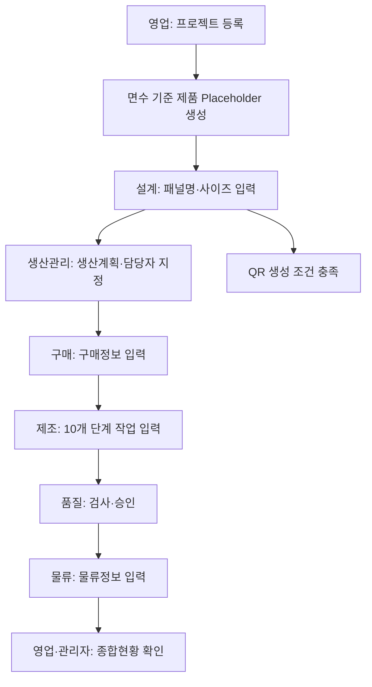

# 2. 전체 업무 흐름

현재 확정된 흐름은 부서별 책임과 데이터 입력 범위입니다. 각 단계의 정확한 시작조건·완료조건·차단조건은 해당 TASK 시작 전에 확정하며, 제조 단계는 자유순서와 동시 진행을 허용합니다.

## 단계별 책임

| 단계 | 주 담당 | 주요 결과 |
|---|---|---|
| 프로젝트 등록 | 영업 | 고객사, Item, PJT Code, PJT Title, 면수, 납기일, 영업담당자, 선택 판매정보 |
| 설계 | 설계 | 패널명, W/H/D 사이즈, QR 생성 조건 |
| 생산 계획 | 생산관리 | 프로젝트별 업무 담당자 지정, 제조 준비 기준 |
| 구매 | 구매 | 통상납기, 발주품목, 기술 담당자, 발주일, 입고예정일 |
| 제조 | 제조 | 10개 제조단계 시작·종료, 중단 사유, 작업 묶음 |
| 품질 | 품질 | IQC, LQC, 자체검수, 고객검수, FAT, 사진 필수 이력 |
| 물류 | 물류 | 물류정보, 출하 관련 이력 |
| 알림 | 시스템 | 담당자, 영업담당자, 관리자 순서의 내부 알림 |

## 조회와 입력 원칙

- 모든 활성 사내 사용자는 모든 프로젝트와 모든 부서 기능을 조회할 수 있습니다.
- 등록·수정·완료·취소는 해당 업무 담당 부서만 수행합니다.
- 화면에서 버튼을 숨기는 것만으로 권한을 처리하지 않고, 모든 쓰기 API는 서버 정책으로 다시 검사합니다.
- 보류·취소 프로젝트는 진행 업무를 중단하지만 기존 데이터 조회는 허용합니다.
