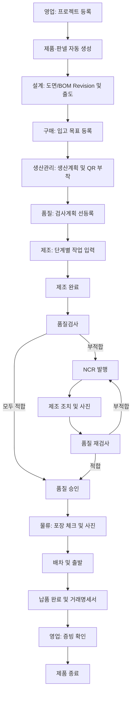

# 2. 전체 업무 흐름

## 단계별 책임

| 단계 | 주 담당 | 주요 결과 |
|---|---|---|
| 프로젝트 등록 | 영업 | 프로젝트·제품 기본정보 |
| 설계 출도 | 설계 | 도면/BOM Revision |
| 자재 계획 | 구매 | 입고목표·실입고 현황 |
| 생산 계획 | 생산관리 | 일정·담당팀·QR |
| 제조 | 제조 | 조립단계·작업사진·완료 |
| 검사 | 품질 | 결과·측정값·사진·승인 |
| 부적합 조치 | 제조/품질 | NCR·조치·재검사 이력 |
| 포장·출하 | 물류 | 포장·차량·기사·출발 |
| 납품 확인 | 물류/영업 | 서명 증빙·최종 확인 |
