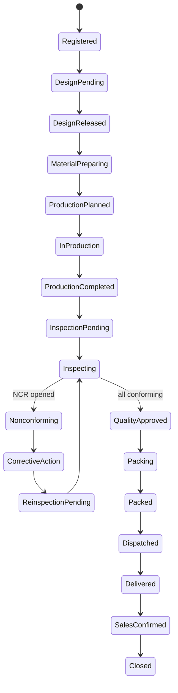

# 3. 상태 모델

## 제품 상태

## 예외 상태

- OnHold: 보류
- Cancelled: 취소
- EmergencyStop: 긴급 중단
- DesignChangePending: 설계변경 대기

예외 상태 진입·해제에는 사유, 처리자, 일시, 필요 시 승인자를 기록합니다.

## 통제 규칙

- 설계 출도 전 생산 시작은 원칙적으로 불가합니다.
- 생산 완료 전 최종 품질검사는 불가합니다.
- 열린 NCR이 있으면 품질 승인 불가입니다.
- 품질 승인 전 포장 완료·출발 처리는 불가합니다.
- 포장 완료 전 출발 처리는 불가합니다.
- 납품 증빙 전 납품 완료 처리는 불가합니다.
- 영업 확인 전 제품 종료는 불가합니다.
- 상태 전이는 서버가 검증하며 클라이언트가 임의로 상태값을 지정하지 못합니다.

## 프로젝트 상태

등록, 진행예정, 진행중, 일부출하, 전량출하, 완료, 보류, 취소.

프로젝트 상태는 하위 제품 상태를 바탕으로 자동 계산하는 것을 기본으로 합니다.
