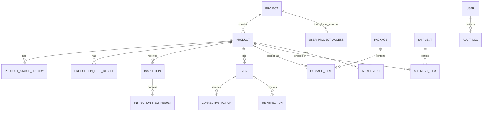

# 5. 핵심 데이터 개체

## 주요 관계



## 최소 개체

- User, Department, Role, Permission, UserProjectAccess
- Project, Product, ProductType
- ProjectCorrectionHistory, ProductPlaceholder
- ChecklistTemplate, ChecklistRevision
- PurchasePlan, ProductionPlan, ProductionStep, ProductionStepResult, WorkBatch
- InspectionPlan, Inspection, InspectionItemResult
- NCR, CorrectiveAction, Reinspection
- Package, PackageItem, Shipment, ShipmentItem, DeliveryEvidence
- Attachment, Notification, AuditLog, CorrectionRequest

설계 도면 업로드, 도면 Revision, BOM Revision은 현재 확정 범위가 아닙니다. 설계 TASK에서는 패널명과 W/H/D(mm) 사이즈를 직접 입력 또는 엑셀 업로드로 입력하는 구조를 우선합니다.

## 식별자 원칙

사람이 보는 업무번호와 DB 내부 ID를 분리합니다.

```text
PJT Code: 영업 입력값이며 중복 허용
PJT Title: 앞뒤 공백 제거, 연속 공백 축소, 대소문자 무시 기준으로 삭제되지 않은 프로젝트끼리 중복 불가
제품 Placeholder: P01, P02 ...
내부 ID: UUID 또는 동등한 불투명 식별자
QR 값: 내부 ID를 직접 노출하지 않는 임의 토큰 또는 제한된 조회키
```

프로젝트 등록 시 내부 Project ID는 UUID로 생성하고, 면수만큼 `P01`, `P02` 형식의 제품 Placeholder를 생성합니다. 제품명과 패널명은 최초 프로젝트 등록 때 입력하지 않습니다.

TASK-003A-1 기준 프로젝트는 포장방식을 `WoodenCrate`, `StretchWrap`, `HeavyDutyBox` 중 하나로 저장합니다. 기존 프로젝트는 포장방식 미지정(null)을 허용하지만 신규 등록과 일반정보 수정 저장 시에는 선택해야 합니다.

프로젝트 삭제는 상태값이 아닙니다. `deleted_at_utc`가 null이면 일반 프로젝트이고, 값이 있으면 삭제 보관함에서만 조회되는 논리삭제 프로젝트입니다. 삭제된 프로젝트의 패널 Placeholder와 감사이력은 보존합니다.

삭제 Guard는 삭제 transaction의 DB connection/transaction을 공유합니다. 후속 project-scoped write는 project row를 같은 순서로 잠그고 `deleted_at_utc is null`과 업무 상태를 같은 transaction에서 확인한 뒤 하위 데이터를 저장해야 합니다. 삭제시각은 DB에 저장된 `deleted_at_utc`가 기준이며 API 응답과 감사이력은 이 값을 사용합니다.

## 민감 필드

- 판매금액은 `Project.SalesAmount.Read` 권한이 있는 Sales와 System Administrator만 조회할 수 있습니다.
- 제조 소요시간은 `Manufacturing.WorkTime.Read` 권한이 있는 Sales와 System Administrator만 조회할 수 있습니다.
- 실제 Project DTO와 제조시간 API의 응답 필터링은 해당 업무 API TASK에서 구현합니다.
