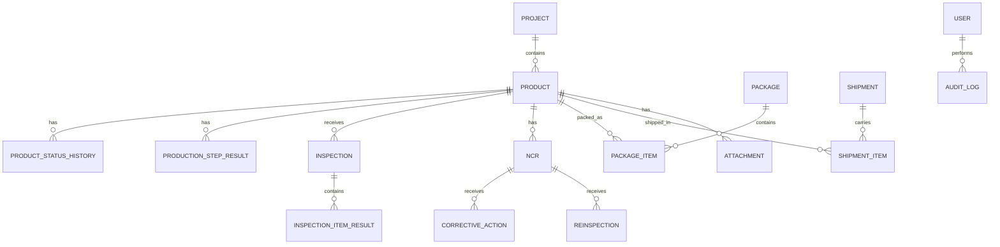

# 5. 핵심 데이터 개체

## 주요 관계



## 최소 개체

- User, Department, Role, Permission, UserProjectAccess
- Project, Product, ProductType
- DrawingRevision, BomRevision, ChecklistTemplate, ChecklistRevision
- MaterialPlan, ProductionPlan, ProductionStep, ProductionStepResult
- InspectionPlan, Inspection, InspectionItemResult
- NCR, CorrectiveAction, Reinspection
- Package, PackageItem, Shipment, ShipmentItem, DeliveryEvidence
- Attachment, Notification, AuditLog, CorrectionRequest

## 식별자 원칙

사람이 보는 업무번호와 DB 내부 ID를 분리합니다.

```text
업무번호: 412630093-P01
내부 ID: UUID 또는 동등한 불투명 식별자
QR 값: 내부 ID를 직접 노출하지 않는 임의 토큰 또는 제한된 조회키
```
