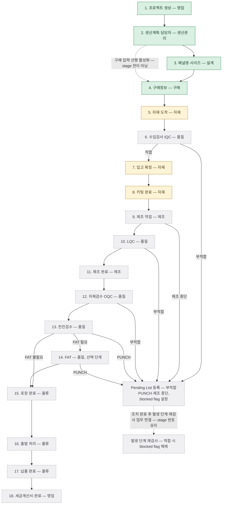
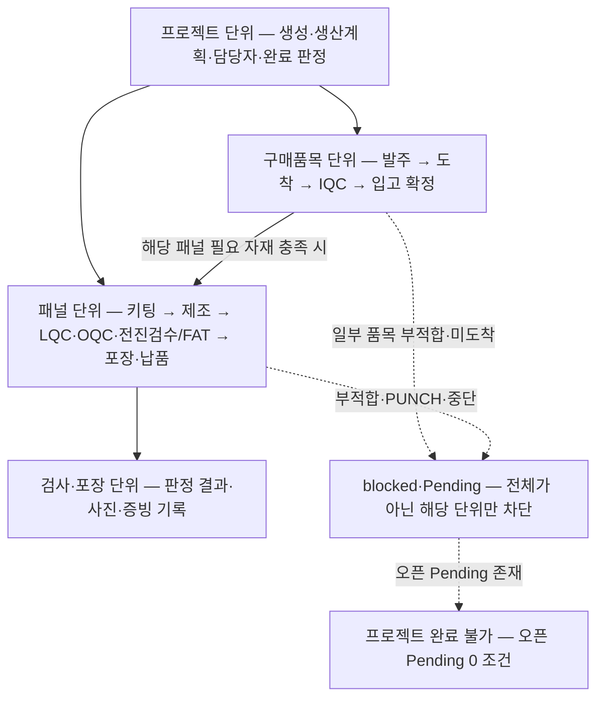
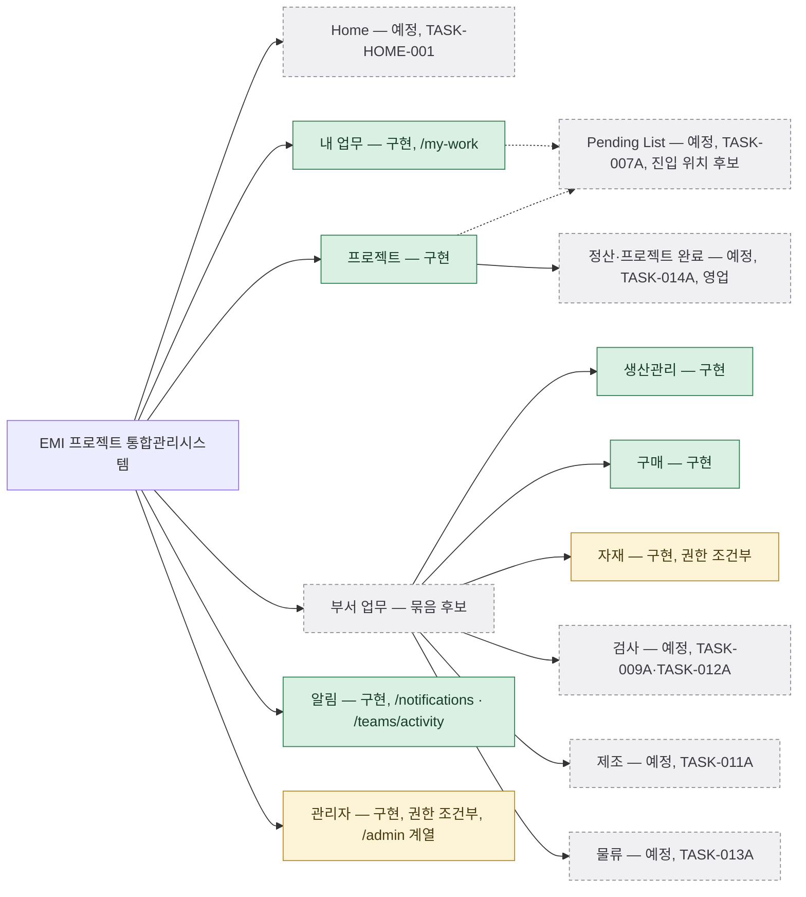

# EMI 프로젝트 통합관리시스템 전체 유저플로우

- previewStatus: `DRAFT_FOR_USER_REVIEW`
- sourceTask: `TASK-USER-FLOW-001`
- authoringModel: `FABLE_5`

## 1. 문서 목적과 지위

이 문서는 사용자가 혼자 “다음에 무엇을 왜 개발할 것인가”를 판단하기 위한 **개인 개발 판단용 참고 자료**다. EMI 프로젝트 통합관리시스템에서 한 역할이 로그인부터 자기 업무 완료·인수인계까지 웹사이트를 어떻게 통과하는지의 전체 그림, 현재 구현과 목표 상태의 gap, 후속 Task 의존성, 권장 개발 순서를 한 곳에 모은다. 이 전문은 Codex 내용 review 뒤 사용자가 명시 요청한 Fable 재작성본이다(Change 004).

이 문서의 지위는 다음과 같다.

- 이 문서는 **canonical 제품 계약이 아니고, 사용자 온보딩·교육 문서도 아니다**. 제품 방향과 Task 순서의 source of truth는 [Product Roadmap](00-product-roadmap.md)이며, 각 기능은 별도 interview·planning·review를 거친다.
- 내용이 충돌하면 **Product Roadmap, 승인된 최신 Task 계약, 실제 Backend 정책이 이 문서보다 우선**한다. 이 문서는 그 충돌을 발견하는 재료일 뿐 판정 기준이 아니다.
- 이 문서는 기획 판단 자료이며 기술 기준선이 아니다. 권한은 계속 서버 Policy가 authoritative하고, 이 문서는 권한·데이터·알림 계약을 새로 정의하거나 확대하지 않는다.
- 18단계 순서·완료 기준·다음 담당자 연결, 담당자 fallback 순서, 알림 채널 matrix는 [Product Roadmap](00-product-roadmap.md)(4·5·6절)의 확정 내용을 재사용하며 임의로 재해석하거나 상태를 올리지 않는다.
- 기존 [`docs/02-business-flow.md`](02-business-flow.md)와 [`docs/04-permission-matrix.md`](04-permission-matrix.md)는 이 Task에서 변경하지 않았다. 두 문서의 정렬(Phase B)은 이 문서 사용의 선행조건이 아니며 **보류**한다. 외부 공유나 canonical 게시가 필요해질 때만 별도 `DOCS_GOVERNANCE` 범위로 재검토한다.

### 1.1 판단 표기 범례

이 문서의 주요 판단은 다음 세 범주로 구분해 표기하며 서로 혼동하지 않는다.

- `확정/현재 계약` — Roadmap·Decision Log·실제 구현 또는 사용자 확인으로 이미 정해진 사실
- `권고/후보` — Codex 내용 review가 제품 가치와 의존성을 근거로 제안한 방향. 후속 Task 순서·정책 승인이 아니다
- `미확정/후속 위임` — 개별 NEW_FEATURE interview·planning과 사용자 승인이 필요한 항목

특히 `Pending → 병목 집계 → 자재 도착 → IQC → 키팅 → 제조 handoff` 우선 검토는 이 문서의 `권고/후보`이며, 실제 Roadmap 순서 변경이나 기능 구현 승인으로 사용하지 않는다.

### 1.2 상세도 계약

- **구현 구간**(프로젝트~구매·자재 입고, 내 업무, 알림, 관리자, 로그인·승인 대기): 실제 화면·경로 기준 상세 flow로 기록한다.
- **미구현 구간**(검사·제조·물류·정산·Pending List·Home): 진입점·핵심 행동·완료 시 다음 담당자 연결 수준의 중간 상세도로 기록하고, 세부 화면·양식·정책은 도입 Task의 planning 승인 항목으로 위임 표기한다. 미구현 행동은 `예정`으로 구분하며 존재한다고 단정하지 않는다.

## 2. 공통 진입점 3유형

모든 역할 여정은 다음 3유형의 진입점을 공통 패턴으로 사용한다. `확정/현재 계약`

| 유형 | 설명 | 현재 상태 |
| --- | --- | --- |
| 내 업무 카드 | `내 업무` 목록의 카드에서 해당 업무로 이동한다. 시작/완료 상태가 동기화된다. **내 업무는 이미 생성된 업무의 진입점이며, 새 프로젝트 생성의 진입점이 아니다.** | 구현 — 이동 대상은 두 갈래(아래 “카드 이동 대상” 참조) |
| 알림 deep link | 인앱 알림, Teams Activity, 일일 요약 메일의 deep link로 특정 업무·알림 상세에 진입한다. | 구현 — 구현된 경로는 2.1 참조 |
| 메뉴 직접 진입 | 상단 내비게이션 메뉴로 각 업무 화면에 직접 진입한다. | 구현 — 목표 골격은 5절 |

현재 구현에서 내 업무 카드의 이동 대상은 두 갈래다.

- **실제 입력 페이지 직접 연결(구현)**: 생산계획·담당자, 패널명·사이즈, 구매정보 업무는 카드에서 해당 입력 페이지로 직접 이동한다.
- **workflow 요약 fallback(구현)**: 자재 도착 이후 단계의 업무는 전용 입력 화면 도입 전까지 프로젝트 상세의 workflow 요약으로 이동한다. 각 단계 카드의 실제 입력 페이지 직접 연결은 해당 단계 도입 Task에서 추가한다(`예정`, 10절 매핑 참조).

### 2.1 구현된 deep link 진입 경로 (code-derived)

- `/my-work` — 내 업무
- `/notifications` — 알림 목록
- `/teams/activity`, `/teams/activity/deliveries/…`, `/teams/activity/notifications/…` — Teams Activity tab과 상세
- `/admin` 계열 — 관리자 홈, 사용자·부서·휴일·권한 read-only, 기준정보·업무 이력, 수동 알림 발송, 발송 delivery·에스컬레이션 조회

### 2.2 알림 채널 역할

- 인앱: 기록(Record) — 모든 알림의 원본.
- Teams: 개입(Interrupt) — 지금 봐야 하는 것만. 자동 event별 적용 상태는 Roadmap 6.5.2.2를 따르며 이 문서가 상태를 올리지 않는다.
- 메일: 요약·증빙 — 일일 요약 07:30 1통, 긴급/차단·에스컬레이션만 실시간.

deep link 진입 실패 시 공통 예외 E4(7절)를 따른다.

## 3. 18단계 마스터 플로우

18단계 표준 업무 프로세스와 역할 간 인수인계 전체를 하나의 마스터 flow로 본다. 각 단계 완료 시 시스템이 다음 담당자의 내 업무를 자동 생성하고 참조 대상자에게 참조 알림을 생성한다. `확정/현재 계약`(Roadmap 4·5·6절 재사용)

- 실선 채움: 구현(1~4단계 입력 화면). 옅은 노랑: 부분 구현(자재는 현재 자재 입고 입력 기반이 구현되어 있고 도착/입고 확정/키팅 분리는 `TASK-008A`·`TASK-010A` 예정). 점선 node: 입력 화면 미구현(도입 Task는 10절 매핑 참조).
- 표준 stage 전이는 **2→3→4**다. 점선 2→4는 stage 전이가 아니라, 현재 구현에서 생산계획 완료 저장 시 설계·구매 내 업무가 함께 생성되어 구매 입력이 **선행 활성화**되는 것을 나타낸다. 각 단계의 완료 판정은 해당 단계 필수 기준 충족 시에만 이뤄진다.
- 부적합·PUNCH·제조 중단은 **stage 번호를 후퇴시키지 않는다**. 해당 패널에 blocked flag를 설정하고 Pending List로 관리하며, 조치 완료 후 발생 단계의 재검사 업무로 연결한다. 재검사 적합 시 blocked flag를 해제한다(Roadmap 9.5). 예: LQC 부적합 → LQC 재검사, FAT PUNCH → FAT 재검사. 구매품 부적합의 반송·현장 수리 세부 흐름은 Roadmap 16절을 따르고 화면 세부는 `TASK-007A`·`TASK-009A`에 위임한다.
- 14 FAT는 프로젝트 생성 시 선택한 FAT 필요 여부에 따르는 선택 단계다.
- 담당자가 없거나 비활성이면 fallback 확정 순서(해당 단계 정담당자 → 부담당자 → 영업 정 → 영업 부 → System Administrator)로 다음 내 업무 대상자를 정한다(공통 예외 E2).
- 이 도식은 단계 순서를 고정하는 것이며, 실제 데이터가 하나의 직렬 흐름으로 움직인다는 뜻이 아니다. 업무 단위별 병렬 진행은 4절의 dependency map으로 함께 판단한다.

## 4. 업무 단위와 병렬 진행 dependency map

18단계 도식만 보면 프로젝트 하나가 1→18로 직렬 이동하는 것처럼 보이지만, 실제 EMI 업무는 서로 다른 단위가 병렬로 전진한다. 다음 기능의 데이터 모델과 Task 분할을 판단할 때 이 map을 함께 사용한다. 단위 구분 자체는 Roadmap의 데이터 단위·상태 집계 원칙(3.2·9절)을 따르는 `확정/현재 계약`이고, 이를 개발 판단 기준으로 쓰는 방식은 `권고/후보`다.

- **프로젝트 단위**: 초기 생산계획·담당자 지정과 최종 완료 판정의 단위다. 프로젝트 대표 단계·진행률은 하위 단위 상태의 집계다(Roadmap 9절).
- **구매품목 단위**: 발주·도착·IQC·입고 확정은 구매품목별로 진행한다. 일부 품목만 먼저 도착·검사·입고될 수 있다.
- **패널 단위**: 키팅·제조·검사·납품은 패널별로 진행한다. blocked flag는 패널 단위로 설정·해제되며, 일부 패널만 다음 단계로 전진할 수 있다.
- **검사·포장 단위**: 판정 결과와 사진·증빙이 남는 기록 단위다.
- **전체 완료를 막는 것**: 오픈 Pending, 미완료 패널, 필수 증빙 누락. 일부 단위의 차단이 곧 프로젝트 전체의 정지를 뜻하지 않으므로, 화면·집계·업무 생성 설계에서 “어느 단위가 차단되고 어느 단위는 계속 가는가”를 항상 구분해야 한다.
- 후속 기능 planning에서 프로젝트 전체 stage와 구매품목·패널 상태를 잘못 결합하지 않는 것이 이 map의 핵심 용도다.

## 5. 목표 내비게이션 골격

목표 메뉴 골격은 **Home · 내 업무 · 프로젝트 · 부서 업무 · 알림 · 관리자**를 후보 골격으로 본다. 미구현 메뉴·화면은 해당 도입 Task 승인·구현 전까지 Frontend에 노출하지 않는다(`확정/현재 계약`).

- “부서 업무”는 아직 검증되지 않은 **묶음 후보**다(`미확정/후속 위임`). 현재 구현은 생산관리·구매·자재를 상단 메뉴에 개별 항목으로 표시하며, 묶음 UI로의 전환 여부·시점은 각 부서 업무 도입 Task와 모바일·내비게이션 planning에서 결정한다.
- Pending List의 내 업무·프로젝트 하위 위치는 **확정이 아니라 `TASK-007A` 검토 후보**다(`미확정/후속 위임`). 내 업무·프로젝트에서의 contextual 진입과 함께, 생산관리 담당자가 전체 이슈를 관리할 전용 관리 workspace의 필요 여부를 `TASK-007A`에서 같이 검토한다. 화면 세부·첨부·유형 정책도 `TASK-007A`에 위임한다.
- 정산은 **영업의 프로젝트 하위**로 위치를 확정한다(사용자 결정 3A, `확정/현재 계약`). 세금계산서·완료 권한 정책은 `TASK-014A`에 위임한다.

## 6. 현재 구현 대 목표 상태

| 메뉴/화면 | 현재 상태 (Repository 기준) | 목표 상태 | 도입 Task |
| --- | --- | --- | --- |
| Home | 없음 | PC·모바일 widget-slot 요약 홈. 세부 위임. 구현 시점은 집계 데이터 안정 뒤 권고(13절) | `TASK-HOME-001` |
| 내 업무 | 구현 — 목록·KPI·프로젝트별 그룹, 시작/완료 동기화, 미처리 badge. 카드의 실제 입력 페이지 직접 연결은 생산관리·설계·구매 업무이고, 그 외 단계 업무는 프로젝트 workflow 요약으로 이동 | 미구현 단계 업무는 각 도입 Task가 카드 직접 연결 추가 | 해당 단계 Task |
| 프로젝트 | 구현 — 생성·목록·상세·수정·상태 변경·삭제/복구/보관함, FAT 필요 여부, workflow 기준 상태/진행률 | 패널 단위 병목 집계·Pending 차단 flag 연동 | `TASK-007B` |
| 생산관리 | 구현 — dashboard, 생산계획 조회/수정, 담당자 지정, Excel, 휴일 캘린더 | 유지 | — |
| 구매 | 구현 — dashboard, 직접 입력·Excel preview/apply, 입고 완료 | 유지 | — |
| 자재 | 구현(권한 조건부) — 자재 입고 입력 기반. 자재 단계 내 업무 카드의 이 화면 직접 연결은 없음(`예정`) | 자재 도착 / 입고 확정 / 키팅 완료 흐름 분리, 내 업무 카드 직접 연결 | `TASK-008A`, `TASK-010A` |
| 검사 | 없음 | IQC 디지털 성적서·PDF, LQC/OQC/전진검수/FAT | `TASK-009A`, `TASK-012A` |
| 제조 | 없음 | 제조 체크리스트, 작업 시작·종료, 제조 중단 | `TASK-011A` |
| 물류 | 없음 | 포장 구성·출발·납품 완료 | `TASK-013A` |
| 정산 | 없음 | 세금계산서 발행·프로젝트 완료 | `TASK-014A` |
| Pending List | 없음 | 이슈 단위 공통 모듈. 진입 위치(contextual 진입·전용 workspace)는 후보 검토 | `TASK-007A` |
| 알림 | 구현 — 전체/읽음/읽지 않음, 프로젝트별 그룹, 읽음 처리, Teams Activity tab·상세, 외부 delivery 이력 | Activity Feed 자동 event coverage 확대는 Roadmap 6.5 상태를 따름 | 후속 NOTIFY 계열 |
| 관리자 | 구현(권한 조건부) — 사용자·부서·휴일·권한 read-only·이력·알림 운영 | 기준정보 통합 여부는 후속 사용자 결정 | 후속 ADMIN 계열 |
| 승인 대기 | 구현 — 로그인 직후 자동 안내 | 유지 | — |

loading·empty·error·success와 공통 Action Feedback은 기존 공통 기준을 보존 참조하며 이 문서가 재정의하지 않는다.

## 7. 공통 예외·복구 흐름 4종

모든 여정이 참조하는 공통 예외를 한 번 정의한다. 구현 구간 여정은 실제 경로 기준 단계별 예외를 8절에 상세 기록하고, 미구현 구간 여정은 “Pending 연결과 다음 담당자 알림” 수준까지만 기록한다.

### E1 — 권한 없음·승인 대기 진입

- 권한 없는 화면·행동은 서버 Policy가 차단하고 UI는 해당 버튼·메뉴를 숨길 수 있으나 숨김이 보안을 대체하지 않는다.
- active role 0개 사용자는 로그인 직후 승인 대기 화면으로 안내되고 `/api/me`·본인 프로필·승인 대기 안내·로그아웃 외 업무 데이터를 조회할 수 없다.
- 복구: 관리자가 역할을 부여하면 다음 진입부터 해당 역할 여정에 합류한다.

### E2 — 담당자 부재 fallback

- 단계 완료 시 다음 담당자가 없거나 비활성이면 확정 순서로 대상자를 정한다: 해당 단계 정담당자 → 부담당자 → 영업 정담당자 → 영업 부담당자 → System Administrator.
- fallback으로 결정된 업무·알림에는 담당자 누락 정보가 포함될 수 있다.
- 복구: 생산관리가 담당자를 지정·보완하면 이후 업무는 정상 대상자로 생성된다.
- fallback은 업무 **생성 시점**의 담당자 누락을 해결한다. 이미 생성된 미완료 업무를 퇴사·부서이동·휴직 시 누가 인수하는지(재배정)는 미확정이며 12절의 공통 질문으로 후속 planning에 위임한다.

### E3 — Pending 차단

- 부적합·고객사 PUNCH·제조 중단·필수 입력 누락은 Pending List 등록과 긴급/차단 알림으로 관리한다. 긴급/차단은 에스컬레이션 L1에서 시작한다.
- 차단은 **stage 번호를 되돌리지 않는다**. 해당 패널에 blocked flag를 설정하고, 조치 완료·재검사 요청 시 발생 단계의 재검사 업무로 연결하며, 재검사 적합 시 blocked flag를 해제한다(Roadmap 9.5). 오픈 Pending이 남아 있으면 프로젝트를 완료 처리할 수 없다.
- Pending List 화면·첨부·유형 세부는 `TASK-007A` 도입 전이므로, 도입 전 구간은 “Pending 연결과 다음 담당자 알림” 수준으로만 동작을 기술한다.

### E4 — 알림·deep link 진입 실패

- deep link 진입 시 인증·권한을 확인하고 실패하면 로그인 또는 권한 안내로 보낸다.
- 대상 데이터가 없거나 접근 불가하면 현재 UI는 **오류 안내와 함께 목록으로 돌아가는 버튼을 제공**한다. 자동으로 목록 화면으로 이동시키지는 않으며, 자동 복귀를 도입할지는 후속 Task의 결정 사항이다.
- Teams·메일 발송 실패는 업무 흐름을 막지 않는다(인앱이 원본). 실패 건은 재시도·관리자 delivery 조회로 추적한다.
- 복구: 사용자는 인앱 알림 목록 또는 내 업무에서 같은 업무로 다시 진입할 수 있다.

## 8. 13개 역할 여정

여정 단위는 권한 role이 아니라 유저플로우 단위이며 기존 Backend 권한 계약을 그대로 보존한다. 모든 여정은 동일 URL·page-level overflow 0 원칙을 따르고, 역할·화면별 narrow(390px·Teams pane) UX 상세와 우선순위는 `TASK-MOBILE-001`에 위임한다.

### 8.1 영업 — 프로젝트 생성(1)과 세금계산서·완료(18)

- 한 줄 요약: “프로젝트를 시작하고, 납품 후 세금계산서 발행까지 확인해 프로젝트를 끝낸다.”
- 구간 상태: 1단계 구현 상세 / 18단계 예정(`TASK-014A`)
- 정상 흐름(1단계, 실제 경로 기준):
  1. `프로젝트` 메뉴의 **프로젝트 목록에서 생성 action으로 진입**해 고객사, Item, PJT Code, PJT Title, 면수, 납기일, 영업담당자, 포장방식, FAT 필요 여부를 입력한다. **새 프로젝트 생성은 이 경로에서만 시작한다. `내 업무`는 새 프로젝트 생성 진입점이 아니며, 생성 이후 배정된 업무의 진입점으로만 사용한다.**
  2. 저장 시 시스템이 생산계획 skeleton을 자동 생성하고, 생산관리 담당자에게 “생산계획·담당자 입력” 내 업무를, 관련 부서에 프로젝트 생성 참조 알림을 생성한다.
  3. 영업 담당자는 프로젝트 상세와 workflow 요약에서 단계별 상태·진행률을 확인한다.
- 단계별 예외(구현 구간 상세): 필수 필드 validation 실패 시 저장이 차단되고 입력 화면에서 오류를 안내한다. 권한 없는 사용자의 생성·수정은 서버 Policy가 차단한다(E1). 담당자 미지정 프로젝트는 E2 fallback으로 다음 업무 대상자가 정해진다. 삭제된 프로젝트는 영업이 **보관함에서 조회**할 수 있다. **복구는 영업 흐름이 아니다** — 복구 endpoint와 UI는 `Audit.Read.All` 권한에 한정되며, 현재 이 권한은 System Administrator만 보유하므로 복구는 관리자 여정(8.12)에 속한다.
- 18단계(예정): 모든 패널 납품 완료 후 영업 내 업무로 “세금계산서·완료 처리”가 생성되고, 세금계산서 발행 완료 체크와 오픈 Pending 0건 조건으로 프로젝트를 완료 처리한다. 완료 시 관련 부서에 완료 알림을 보낸다. 권한·화면 세부는 `TASK-014A` 위임.
- 완료 시 연결: 1단계 → 생산관리 내 업무. 18단계 → 없음(최종 완료).

### 8.2 설계 — 패널명·사이즈(3)

- 한 줄 요약: “배정된 프로젝트의 패널명과 사이즈를 입력해 구매가 진행되게 한다.”
- 구간 상태: 구현 상세
- 정상 흐름: 내 업무 카드 “패널명·사이즈 입력”(실제 입력 페이지 직접 연결) 또는 `프로젝트` 상세의 패널정보에서 진입한다. 패널명·사이즈를 직접 입력하거나 Excel preview/apply로 일괄 입력한다. 활성 패널의 필수 정보가 채워지면 설계 단계가 완료 판정되고 구매 단계로 이어지며 생산관리에 참조 알림이 간다. 구매 내 업무는 생산계획 완료 시 이미 선행 생성되어 있다(8.3 참조).
- 단계별 예외(상세): 목포장 프로젝트는 사이즈가 필수이며 누락 시 저장이 차단된다. Excel import는 preview에서 오류 행을 표시하고 저장 가능한 행만 적용한다. 권한 없음은 E1.
- 완료 시 연결: 구매 “구매정보 입력” 단계 진행(4단계 완료 판정 가능 상태).

### 8.3 생산관리 — 생산계획·담당자(2)와 참조 흐름

- 한 줄 요약: “생산계획과 부서별 담당자를 지정해 전체 흐름을 가동하고, 이후 전 단계를 참조로 지켜본다.”
- 구간 상태: 구현 상세
- 정상 흐름: 프로젝트 생성 시 자동 생성된 “생산계획·담당자 입력” 내 업무 카드(실제 입력 페이지 직접 연결) 또는 `생산관리` 메뉴 dashboard로 진입한다. Item 기준 생산계획 단계·예정일을 확인·수정하고(캘린더는 공휴일/영업일 반영), 영업·설계·생산관리·구매·자재·제조·물류의 정·부 담당자와 품질 단계별(IQC·LQC·OQC·전진검수/FAT) 정·부 담당자를 지정한다. 필수 예정일·필수 담당자 기준을 충족하면 2단계가 완료되고, 생산계획 완료 저장 시 **설계·구매 내 업무가 함께 생성**되어 구매 입력이 선행 활성화되며 영업·구매·제조에 참조 알림이 간다. 이는 stage 전이가 아니며, 표준 stage 순서는 2→3→4로 유지되고 각 단계의 완료 판정은 해당 단계 필수 기준 충족 시에만 이뤄진다.
- 참조 흐름: 이후 대부분 단계의 참조 알림 수신자로서 알림 페이지(프로젝트별 그룹)와 프로젝트 workflow 요약으로 전체 진행을 추적한다. 예정일 초과 에스컬레이션 L2·L3의 수신 대상이다.
- 단계별 예외(상세): 필수 담당자 누락 시 완료가 차단된다. 담당자 부재는 E2. Pending 관리 화면에서 다른 부서 업무를 생성하는 능력은 `TASK-007A` 도입 시 제공한다(예정). 생산관리의 전체 Pending 관리 workspace 필요 여부는 `TASK-007A` 검토 후보다(5절).
- 완료 시 연결: 설계 내 업무·구매 내 업무 생성(구매 입력 선행 활성화).

### 8.4 구매 — 구매정보(4)

- 한 줄 요약: “발주 정보를 품목 단위로 입력해 자재 입고를 준비시킨다.”
- 구간 상태: 구현 상세
- 정상 흐름: 내 업무 카드(실제 입력 페이지 직접 연결) 또는 `구매` 메뉴 dashboard로 진입한다. 구매 내 업무는 생산계획 완료 시 선행 생성되어 3단계 진행 중에도 입력을 시작할 수 있으나, 4단계 완료 판정은 표준 순서(2→3→4)에 따라 이뤄진다. Item별 필수 구매 항목 skeleton에 발주품목, 업체/기술 담당자, 발주일, 입고예정일, 이슈를 구매품목 단위로 직접 입력하거나 Excel preview/apply로 입력한다. 필수 항목의 실제 입력이 완료되면 단계가 완료되고 자재 내 업무로 연결되며 생산관리·제조에 참조 알림이 간다.
- 단계별 예외(상세): 자동 생성 row만으로는 완료 처리되지 않는다. Excel 오류 행은 적용에서 제외된다. 권한 없음은 E1. 예정일 에스컬레이션 L0~L3은 **현재 `work_items.due_date`가 설정된 업무만** 대상으로 동작한다. 구매 입고예정일(`expected_receipt_date`)을 `due_date`로 자동 동기화하는 정책은 미확정 후속 결정이므로, 입고예정일 임박·초과에 따른 자동 에스컬레이션은 현재 동작이 아니라 `예정` 정책 후보로만 기록한다.
- 완료 시 연결: 자재 “자재 도착 등록” 내 업무.

### 8.5 자재 — 자재 도착(5)·입고 확정(7)·키팅(8)

- 한 줄 요약: “도착한 자재를 등록하고, 검사 적합품을 입고 확정한 뒤, 패널별 키팅으로 제조에 넘긴다.”
- 구간 상태: 부분 구현 — 현재는 자재 입고 입력 기반 화면(권한 조건부 `자재` 메뉴)이 있고, 도착/입고 확정/키팅 분리는 `TASK-008A`·`TASK-010A` 예정
- 정상 흐름(현재 구현 기준): 권한 조건부 `자재` 메뉴로 직접 진입해 구매품목 단위 입고를 입력한다. 자재 단계 내 업무 카드는 현재 이 입력 화면으로 직접 연결되지 않고 프로젝트 workflow 요약으로 이동한다(2절 “카드 이동 대상” 참조). 카드에서 자재 입력 화면으로의 직접 연결은 `예정`이며 `TASK-008A`에서 추가한다.
- 목표 흐름(중간 상세도, 예정): 자재 도착 등록(5) → IQC 요청 → IQC 적합 후 입고 확정(7) → 패널 단위 키팅 완료(8, 부분/일괄). 키팅 완료 시 제조 내 업무로 연결되고 생산관리·제조에 참조 알림이 간다. 분할 입고·사급 자재 세부는 `TASK-008A`·`TASK-008B` 위임.
- 예외: IQC 부적합 시 E3 — Pending 연결과 다음 담당자 알림 수준. 권한 없음 E1, 담당자 부재 E2.
- 완료 시 연결: 5 → 품질 IQC 내 업무, 7 → 자재 키팅 내 업무, 8 → 제조 내 업무.

### 8.6 품질 IQC — 수입검사(6)

- 한 줄 요약: “도착 자재를 검사해 적합이면 입고를, 부적합이면 Pending을 만든다.”
- 구간 상태: 미구현(중간 상세도), 도입 Task `TASK-009A`
- 흐름(예정): 도입 예정 검사 진입점 또는 내 업무 카드로 수입검사 업무에 진입한다. 핵심 행동은 IQC 체크·값 입력·외함 사진·적합/부적합 판정 수준까지 기록한다. 검사 양식·필수 사진 위치·PDF 성적서 세부는 `TASK-009A` planning 승인 항목 위임.
- 완료 시 연결: 적합 → 자재 “입고 확정” 내 업무. 부적합 → E3, Pending 연결과 다음 담당자 알림 수준까지만 기록.

### 8.7 제조 — 제조 작업(9)·제조 완료(11)

- 한 줄 요약: “패널·제조 단계 단위로 작업을 시작·종료하고, LQC 뒤 제조 완료를 처리한다.”
- 구간 상태: 미구현(중간 상세도), 도입 Task `TASK-011A`
- 흐름(예정): 내 업무 카드 또는 도입 예정 제조 진입점으로 진입해 패널·제조 단계 단위로 작업 시작·작업 체크·작업 종료를 입력한다(모바일 체크 클릭 중심). 제조 단계 완료 시 품질 LQC 내 업무로 연결된다. LQC 적합 뒤 제조 완료(11)를 체크하면 품질 OQC 내 업무로 연결된다. 체크리스트·표시 항목 세부는 `TASK-011A` 위임.
- 예외: 제조 중단은 E3 — Pending 연결과 생산관리 알림 수준까지만 기록.
- 완료 시 연결: 9 → 품질 LQC, 11 → 품질 OQC.

### 8.8 품질 LQC — LQC(10)

- 한 줄 요약: “제조 중 패널을 검사해 적합이면 제조를 계속 진행시킨다.”
- 구간 상태: 미구현(중간 상세도), 도입 Task `TASK-012A`
- 흐름(예정): 내 업무 카드 또는 도입 예정 검사 진입점으로 진입해 LQC 체크리스트·값·사진·적합/부적합 판정을 입력한다. 양식 세부는 `TASK-012A` 위임(상세 양식 회신 대기).
- 완료 시 연결: 적합 → 제조 “제조 완료” 내 업무. 부적합 → E3, LQC 재검사 업무 연결(stage 번호 유지) 수준까지만 기록.

### 8.9 품질 OQC — 자체검수(12)

- 한 줄 요약: “완성 패널을 자체검수해 고객 검수 단계로 넘긴다.”
- 구간 상태: 미구현(중간 상세도), 도입 Task `TASK-012A`
- 흐름(예정): 내 업무 카드 또는 도입 예정 검사 진입점으로 진입해 OQC 체크리스트·값·사진·적합/부적합 판정을 입력한다. 양식 세부는 `TASK-012A` 위임.
- 완료 시 연결: 적합 → 품질 “전진검수” 내 업무. 부적합 → E3, OQC 재검사 업무 연결(stage 번호 유지) 수준까지만 기록.

### 8.10 품질 전진검수·FAT — 전진검수(13)·FAT(14)

- 한 줄 요약: “고객 관점 검수와 선택적 FAT을 마쳐 출하 가능 상태를 만든다.”
- 구간 상태: 미구현(중간 상세도), 도입 Task `TASK-012A`
- 흐름(예정): 내 업무 카드 또는 도입 예정 검사 진입점으로 진입해 전진검수 결과와 PUNCH LIST(패널 단위 가능)를 입력한다. FAT 필요 프로젝트는 FAT 결과·고객 확인·PUNCH LIST를 입력하고, FAT 불필요 프로젝트는 전진검수 완료 시 바로 물류로 연결된다. 양식·고객 확인자료 세부는 `TASK-012A` 위임.
- 완료 시 연결: 13 → FAT 또는 물류 “포장 완료” 내 업무, 14 → 물류 “포장 완료” 내 업무. PUNCH → E3, 발생 단계 재검사 업무 연결(stage 번호 유지) 수준까지만 기록. 영업·생산관리 참조 알림.

### 8.11 물류 — 포장(15)·출발(16)·납품 완료(17)

- 한 줄 요약: “포장·상차·납품을 사진과 증빙으로 남기고 영업 정산으로 넘긴다.”
- 구간 상태: 미구현(중간 상세도), 도입 Task `TASK-013A`
- 흐름(예정): 내 업무 카드 또는 도입 예정 물류 진입점으로 진입한다. 포장 완료는 포장번호·포함 패널 매핑·포장 사진(필수), 출발 처리는 상차 사진(필수)·출발일, 납품 완료는 거래명세서 서명본(필수)을 패널 단위(일괄 가능)로 입력한다. Packing Unit 구성·사진·서명본 기준 세부는 `TASK-013A` 위임.
- 완료 시 연결: 15 → 물류 출발, 16 → 물류 납품 완료, 17 → 영업 “세금계산서·완료” 내 업무. 필수 사진 누락 저장 차단·납품 차단은 E3 수준까지만 기록. 영업·생산관리 참조 알림.

### 8.12 System Administrator — 관리자 여정

- 한 줄 요약: “사용자·부서·휴일·이력·알림 발송을 관리하되, 업무 입력을 대신하지 않는다.”
- 구간 상태: 구현 상세(관리자 권한 조건부)
- 정상 흐름: `관리자` 메뉴 또는 `/admin` 계열 deep link로 시스템 관리 중심 dashboard에 진입한다. 사용자 관리(역할/부서/활성 상태), 부서 관리, 휴일 관리(Excel 양식 포함), 권한 매트릭스 read-only, 기준정보·업무 시작/완료 이력, 수동 알림 발송 3모드와 수동 업무 배정, 발송 delivery·에스컬레이션 조회, 삭제 예정·복구 관리(삭제 프로젝트 복구 포함 — 복구는 `Audit.Read.All` 권한 한정)를 수행한다.
- 단계별 예외(상세): System Administrator도 업무 입력을 무제한 우회하지 않는다. 마지막 active System Administrator는 비활성화하거나 system-administrator role을 제거할 수 없다. 승인 대기 사용자에게 active role을 부여하면 승인 대기가 해소된다(E1 복구 경로의 관리자 측). 검수 사용자 전환은 비운영 환경 전용이다.
- 완료 시 연결: 역할 부여 → 해당 사용자가 자기 역할 여정에 합류. 수동 업무 배정 → 대상자 내 업무·알림 생성.

### 8.13 승인 대기 사용자

- 한 줄 요약: “로그인은 됐지만 역할이 없어, 승인될 때까지 안내 화면에서 대기한다.”
- 구간 상태: 구현 상세
- 정상 흐름: 신규 Entra 사용자가 최초 로그인하면 자동 생성되지만 active role 0개로 승인 대기 상태가 된다. 로그인 직후 승인 대기 안내 화면이 표시되고 업무 화면 대신 대기·로그아웃만 가능하다. 조회는 `/api/me`·본인 프로필·승인 대기 안내 수준으로 제한된다(기존 계약).
- 단계별 예외(상세): 승인 대기 해소 기준은 active role 1개 이상이며 department_id는 해소 조건이 아니다. deep link로 업무 화면에 진입해도 승인 대기 계약이 우선한다(E1·E4).
- 완료 시 연결: 관리자 역할 부여 → 해당 역할 여정의 진입점으로 합류. 승인·역할 부여 이력은 기존 정책대로 보존된다.

## 9. 예외 coverage 매핑

| 여정 | E1 권한·승인 대기 | E2 담당자 부재 | E3 Pending 차단 | E4 deep link 실패 |
| --- | --- | --- | --- | --- |
| 영업(1) / 설계 / 생산관리 / 구매 | 상세(8절 각 여정) | 상세 | 참조 — `TASK-007A` 전 수준 | 상세(2.1 경로) |
| 자재 | 상세(구현분) | 상세 | 참조 | 상세 |
| IQC / LQC / OQC / 전진검수·FAT | 참조 | 참조 | 참조 — Pending 연결·알림 수준 | 참조 |
| 제조 / 물류 / 영업(18) | 참조 | 참조 | 참조 — Pending 연결·알림 수준 | 참조 |
| System Administrator | 상세 | 해당 없음(fallback 최종 대상) | 참조 | 상세 |
| 승인 대기 사용자 | 상세 | 해당 없음 | 해당 없음 | 상세 |

“상세”는 실제 구현 경로 기준 단계별 예외를 8절에 기록했다는 뜻이고, “참조”는 7절 공통 정의와 Pending 연결·다음 담당자 알림 수준까지만 기록한다는 뜻이다.

## 10. 후속 Task 매핑과 위임 결정 역색인

도입 Task ID는 [Product Roadmap](00-product-roadmap.md) 실행 큐 기준이며, 각 Task 문서가 생성되기 전까지 Roadmap을 참조 원본으로 사용한다.

| 도입 Task | 이 문서가 참조 기준으로 두는 것 | 이 문서가 위임한 결정 |
| --- | --- | --- |
| `TASK-007A` Pending List | 이슈 단위 목록, E3 공통 예외 연결 | 진입 위치(내 업무·프로젝트 contextual 진입과 전용 관리 workspace의 병행 여부), 화면 세부, 첨부 저장·업로드 보안, Pending 유형·상태 UI, 생산관리의 타 부서 업무 생성 화면 |
| `TASK-007B` 병목 집계 | 프로젝트 상세·목록의 패널 단위 병목·Pending 차단 표시 위치 | 상태 matrix·집계 규칙 세부 |
| `TASK-008A`/`TASK-008B` 자재 | 자재 도착/입고 확정/키팅 분리 흐름과 메뉴 위치, 내 업무 카드→자재 입력 직접 연결 추가 | 분할 입고, 기존 데이터 migration, 사급 자재 정책 |
| `TASK-009A` IQC | 검사 진입점 위치, IQC 핵심 행동(체크·값·사진·판정), 적합→입고 확정 연결 | 검사 양식, 필수 사진 위치, PDF 성적서 snapshot 세부 |
| `TASK-010A` 키팅 | 패널 단위 키팅 완료→제조 연결 | 패널별 키팅·중복 방지 정책 |
| `TASK-011A` 제조 | 제조 진입점 위치, 작업 시작·종료·중단 핵심 행동, LQC·OQC 연결 | 제조 체크리스트·표시·입력 항목 |
| `TASK-012A` 품질 후속 | LQC/OQC/전진검수/FAT 진입점과 단계 연결, FAT 선택 규칙 인용 | 각 검사 양식·사진 기준·고객 확인자료 |
| `TASK-013A` 물류 | 포장·출발·납품 진입점과 연결, 필수 증빙 종류 인용 | Packing Unit 구성, 사진·서명본 화면 기준 |
| `TASK-014A` 정산 | 정산의 영업(프로젝트 하위) 위치(사용자 결정 3A), 완료 조건 인용 | 세금계산서·완료 권한 정책, 화면 세부 |
| `TASK-HOME-001` Home | 메뉴 골격 내 Home 위치, 도입 전 미노출 | widget-slot 구성과 MVP 범위, 구현 시점(13절 권고 참조) |
| `TASK-MOBILE-001` | 동일 URL·overflow 0 원칙의 여정별 적용 선언 | 역할·화면별 narrow UX 상세와 우선순위, 공통 responsive 기반과 현장 입력 능력의 분할 |
| 후속 NOTIFY 계열 | 예정일 에스컬레이션 L0~L3의 현재 입력 기준(`work_items.due_date`) 인용 | 생산계획 예정일·구매 입고예정일(`expected_receipt_date`)의 `due_date` 자동 동기화 여부, due_date 입력·수정 UX |

## 11. 후속 planning 공통 질문·권고

다음 항목은 이 문서가 확정하지 않는 `미확정/후속 위임` 사항이다. 여러 기능이 공통으로 의존하므로, 해당 기능의 planning에서 반복 확인할 공통 질문과 `권고/후보`로 남긴다.

### 11.1 미완료 업무 재배정 (공통 질문)

- E2 fallback은 업무 생성 시점만 해결한다. 퇴사·부서이동·휴직 뒤 이미 생성된 미완료 업무를 누가 인수하는가.
- 재배정의 권한(누가 할 수 있는가), 이력(어떻게 남는가), 알림(누구에게 가는가) 정책이 운영 전에 필요하다.

### 11.2 완료 기록 정정·재개 (공통 질문)

- “단계는 후퇴하지 않는다”는 원칙 위에서, 잘못 완료한 기록을 어떻게 정정하고 누가 재개를 승인하는가.
- 검사·납품 기능 도입 전에 append-only 정정, 재검사, reopen 권한의 방향이 필요하다.

### 11.3 초안 저장·부분 실패·재시도 (공통 질문)

- 모바일 검사·사진·제조 작업은 네트워크·첨부 업로드 실패가 발생할 수 있다.
- 초안 저장, 이어하기, 중복 제출 방지, 일부 패널 일괄 처리 실패 시 복구 방식을 해당 기능 planning의 공통 질문으로 확인한다.

### 11.4 첨부 storage 운영 계약 (공통 선행 권고)

- Pending·IQC·물류·모바일이 공통으로 의존한다. 저장 위치, 파일 크기·형식, 악성 파일 방어, 보존·백업·복구, 접근권한의 최소 계약을 기능별로 반복 설계하지 않도록 먼저 정하는 것을 권고한다.
- 이 결정이 오래 걸리면 text-first slice(첨부 없는 최소 흐름)와 운영용 증빙 완성 단계를 분리하는 방안을 함께 검토한다.

### 11.5 제품 성공 신호 (공통 권고)

문서·기능의 완성 여부가 아니라 업무 결과를 측정한다. 다음 후보 중 2~3개만 선택해도 다음 기능 우선순위 판단이 쉬워진다.

- 다음 담당자에게 전달되지 않은 완료 건수
- 직접 입력 화면으로 연결되지 않는 내 업무 비율
- 장기 미조치 Pending 건수와 평균 체류시간
- 필수 증빙 누락으로 되돌아간 작업 수
- 프로젝트 병목을 찾는 데 걸리는 시간

## 12. 최소 vertical slice와 Now/Next/Later

이 절 전체는 Codex 내용 review에 근거한 `권고/후보`다. 실제 Roadmap 순서 변경, 기능 구현, 정책 확정은 각각 별도 사용자 승인 대상이며 이 문서로 대체하지 않는다.

### 12.1 우선 검토 end-to-end slice

`Pending → 병목 집계 → 자재 도착 → IQC → 키팅 → 제조 handoff`를 첫 end-to-end 제품 slice로 우선 검토한다. EMI의 다음 제품 가치는 Home·디자인·알림 고도화보다 이 slice에서 나온다.

가장 작은 유효 제품 단위(최소 vertical slice)는 다음과 같다.

`구매품목 도착 → IQC 판정 → 부적합 Pending 또는 입고 확정 → 패널 키팅 → 제조 내 업무 생성`

이 slice는 자재·품질·Pending·handoff를 실제로 연결해 EMI의 핵심 가치를 검증한다. 선행조건은 `TASK-007A` Pending 기반, 첨부 storage 최소 계약(또는 text-first 분리), 11절의 재배정·정정 정책 방향이다. 성공 신호는 11.5의 지표 중 선택한 2~3개로 판단한다.

### 12.2 Now

1. 이 문서를 canonical 문서가 아닌 개인 개발 판단 자료로 사용한다. Phase B·게시 의무·전수 갱신은 진행하지 않는다.
2. 프로젝트·구매품목·패널·검사 단위의 병렬 진행 관계(4절 dependency map)를 다음 기능의 데이터 모델·Task 분할 판단 기준에 추가한다.
3. `TASK-007A` Pending List MVP를 먼저 기획한다. 이슈 생성, 조치 담당, 상태, 코멘트, 재검사·종결을 핵심으로 하고, 첨부 storage 결정이 오래 걸리면 text-first UAT slice와 운영용 증빙 완성 단계를 분리한다. 진입 위치(contextual 진입·전용 workspace)는 이 Task에서 검증한다.
4. 신규 화면에 필요한 최소 Action Feedback 계약을 Pending 구현과 함께 적용한다. 별도 대형 UX 개편으로 만들지 않는다.
5. Pending이 안정되면 `TASK-007B` 병목 상태 집계를 구현한다.
6. 병행 정책 결정으로 미완료 업무 재배정, 완료 기록 정정·재개, 첨부 storage 경계를 확정한다(11절).

### 12.3 Next

1. `TASK-008A` 자재 도착·분할 입고
2. `TASK-009A` IQC·사진·부적합 Pending·PDF 기반
3. `TASK-010A` 패널별 키팅·제조 내 업무 생성
4. 위 기능과 함께 모바일 최소 기반을 적용한다 — 동일 URL, 390px overflow 0, 현장 핵심 action, 사진 업로드 실패·재시도.
5. `TASK-011A` 제조 작업·중단
6. `TASK-012A` LQC·OQC·전진검수·FAT
7. 실제 집계 데이터가 충분해진 뒤 Home MVP를 만든다.

현재 Roadmap의 Home 선행 순서는 뒤로 미루고, `TASK-MOBILE-001`은 “공통 responsive 기반”과 “사진·현장 입력 능력”으로 나눠 실제 업무 Task에 맞춰 적용하는 방향을 권고한다. **실제 순서 변경은 별도 Roadmap 승인 대상이다.**

### 12.4 Later

1. `TASK-013A` 물류 포장·출발·납품과 `TASK-014A` 영업 정산·프로젝트 완료
2. 사급 자재(`TASK-008B`)
3. 검사·제조 Template 관리자 기능
4. 실제 사용자 요구가 높은 화면부터 제한적으로 Excel export
5. QR 스캔 landing
6. 사용자별 알림 preference와 terminal Failed 수동 재처리
7. 전체 디자인 foundation과 화면 통일(현재는 공통 component 재사용만)
8. 역할별 UAT가 끝난 뒤 온보딩·교육 문서 작성
9. 외부 공유 또는 canonical 게시가 필요해질 때만 `docs/02-business-flow.md`·`docs/04-permission-matrix.md` 정렬과 이 문서의 지위 재검토

## 13. 유지·재검토 규칙

1. 이 문서는 canonical 기준선이 아니며, **후속 Task의 의무 갱신 대상이 아니다**. 후속 Task는 갱신 없이도 자체 계약과 Roadmap 기준으로 완료 처리할 수 있다.
2. 다음 사건이 생기면 이 자료의 재검토를 **권고**한다(의무 Gate가 아니다): 18단계 순서·담당 역할·완료 조건 변경, 최상위 내비게이션 변경, 공통 진입점·handoff 방식 변경, 프로젝트·구매품목·패널 등 핵심 업무 단위 변경.
3. Backend policy·[Product Roadmap](00-product-roadmap.md)·이 문서 사이에 충돌이 생기면 Roadmap과 승인된 최신 Task 계약, 실제 Backend 정책을 우선하고, 이 문서는 참고 자료로서 필요 시 재검토한다.
4. 미구현 메뉴·화면은 해당 도입 Task 승인·구현 전까지 Frontend에 노출하지 않는다. 도입 Task는 구현 시점에 이 규칙을 계약으로 준수한다(`확정/현재 계약`).
5. 이 문서는 미확정 정책(검사 양식, Pending 첨부, 포장 기준, 재배정·정정 정책 등)을 확정하지 않는다. 10절 역색인의 위임 결정과 11절 공통 질문은 각 도입 Task planning 승인 항목으로만 확정한다.
6. 알림 채널·event coverage 상태는 Roadmap 6.5를 원본으로 인용하며 이 문서에서 상태를 올리지 않는다.
7. 12절의 권장 순서는 `권고/후보`다. 실제 Roadmap 실행 큐 순서 변경과 각 기능 구현은 개별 NEW_FEATURE interview·planning·사용자 승인을 거친다.
